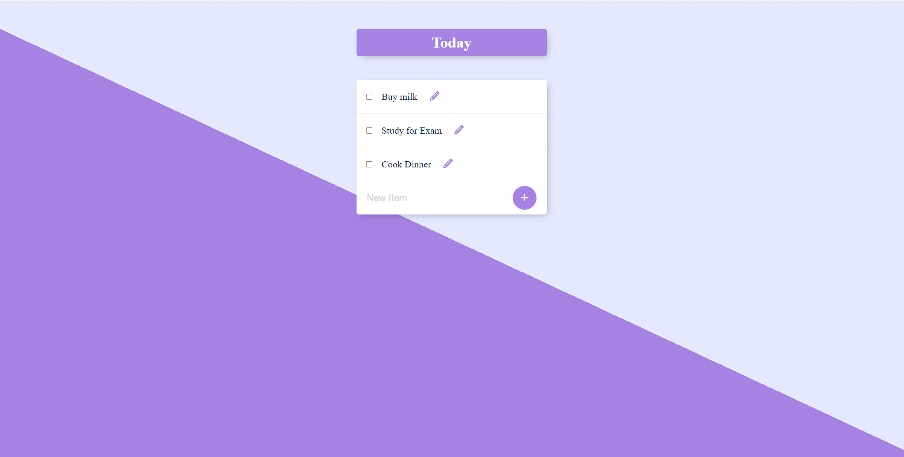

# Task Manager

This project is a web-based Task Manager application that allows users to manage their tasks effectively. Users can add new tasks, delete (mark as done and then delete) tasks, and edit existing tasks. The application is built using PostgreSQL, JavaScript, HTML, CSS, Express, and Node.js.

## Features

- **Add Tasks**: Users can add new tasks to their to-do list.
- **Delete Tasks**: Users can mark tasks as done and it deletes them from the list.
- **Edit Tasks**: Users can edit the details of existing tasks.

## Technologies Used

- **Backend**: Node.js, Express
- **Frontend**: HTML, CSS, JavaScript
- **Database**: PostgreSQL

